# ADR-001: Máquina de estados del medicamento

- **Estado**: Aceptado
- **Fecha**: 2026-08-07
- **Autores**: Serra, Zarlenga

---

## Contexto

El prototipo del PFI representa procesos core del Sistema Nacional de Trazabilidad de Medicamentos (SNT) sobre Hyperledger Fabric. La hipótesis de trabajo exige modelar la trazabilidad de unidades medicinales desde la producción o importación, pasando por transferencias entre agentes, hasta la dispensación o salida extraordinaria del circuito.

La Resolución MS 435/2011 establece que el sistema debe permitir el control y seguimiento desde la producción o importación del producto hasta su adquisición por el usuario o paciente, mediante identificación individual y unívoca y seguimiento a través de toda la cadena de distribución. La Disposición ANMAT 3683/2011, artículo 8, enumera movimientos logísticos que deben comunicarse, incluyendo cuarentena, distribución a un eslabón posterior, recepción, dispensación, código deteriorado/destruido, producto robado/extraviado, producto vencido, devolución, reingreso a stock, producto retirado del mercado y producto prohibido.

El paper y la tesis delimitan el prototipo al flujo downstream del SNT y describen como procesos representables el registro de unidades/lotes, las transferencias de custodia, la dispensación y eventos extraordinarios que bloquean o condicionan operaciones futuras.

Esta ADR define la máquina de estados que deben respetar las implementaciones posteriores. No define firmas de funciones públicas, payloads, errores, estructura persistida, MSP, ABAC, políticas de endoso, topología de canales ni la matriz origen-destino de transferencias. La visibilidad del estado se rige por ADR-002 y la identidad de establecimientos por ADR-003.

## Alternativas

**A. Estados mínimos por aptitud operativa**
- Modelar la unidad solo como `ACTIVA`, `BLOQUEADA` o `TERMINAL`.
- Reduce la cantidad de estados que debe validar el chaincode.
- No permite distinguir eventos exigidos por la issue, como `ROBADO`, `EXTRAVIADO`, `RETIRADO_MERCADO`, `PROHIBIDO` o `DEVUELTO`.
- Se descarta porque pierde trazabilidad semántica y no satisface el criterio de aceptación de DES-1.

**B. Event sourcing sin estado canónico**
- Registrar todos los eventos logísticos y derivar el estado actual consultando la historia completa.
- Conserva detalle histórico de cada movimiento.
- Aumenta la complejidad de lectura y validación determinística en chaincode.
- Se descarta porque la issue requiere una máquina de estados explícita y porque las operaciones futuras necesitan validar rápidamente si la unidad admite transferencia, dispensación o solo resolución administrativa.

**C. Máquina explícita por estado del medicamento**
- Cada unidad posee un estado canónico entre los estados definidos por DES-1.
- Los eventos permitidos se declaran como transiciones origen -> destino con actor lógico y precondiciones.
- Los estados bloqueantes impiden circulación ordinaria y dispensación, pero conservan transiciones administrativas cuando corresponde.
- Se adopta porque hace verificable la regla "el diagrama de estados es el chaincode" sin invadir las decisiones de visibilidad de ADR-002 ni el modelo de identidad de ADR-003.

## Decisión

Se adopta la **alternativa C: máquina explícita por estado del medicamento**.

La versión inicial `1.0.0` de la máquina queda definida por:

- el catálogo de estados de esta ADR;
- la tabla de transiciones;
- la identificación de estados terminales;
- el diagrama Mermaid versionado incluido en el documento.

Toda implementación de chaincode y baseline debe rechazar transiciones no declaradas en esta ADR, salvo que una ADR posterior modifique explícitamente la máquina.

## Justificación

La Disposición ANMAT 3683/2011 enumera movimientos logísticos diferenciados que no son equivalentes desde el punto de vista operacional. Una unidad vencida, robada, extraviada, deteriorada, retirada del mercado, prohibida, devuelta o en cuarentena no admite las mismas operaciones posteriores. Por eso un modelo reducido a "activo/bloqueado" no alcanza para expresar las precondiciones que la issue pide dejar aprobadas antes de implementar chaincode.

La máquina explícita es compatible con ADR-002 porque el `estado del producto` forma parte del estado mínimo de trazabilidad visible en el canal, mientras que esta ADR no define ni replica información comercial o documental que ADR-002 reserva para datos privados. También es compatible con ADR-003 porque los actores de esta ADR son roles lógicos de dominio, no MSP compartidas por categoría: la identidad concreta del custodio o destinatario debe resolverse mediante el registro organización-establecimiento definido por ADR-003.

El estado `EN_TRANSITO` se conserva porque DES-1 lo exige y porque el flujo relevado distingue distribución al eslabón posterior y recepción en establecimiento. La decisión final sobre si esto se implementa como dos transacciones o una operación atómica queda reservada a DES-9, pero cualquier simplificación posterior deberá preservar o modificar explícitamente esta ADR. **Actualización posterior**: [ADR-004](004-transfer-dispatch-reception.md) resolvió DES-9 adoptando las **dos transacciones**; `EN_TRANSITO` y T02–T05 se conservan sin cambios y esta ADR no requiere modificación.

## Alcance

Esta decisión cubre:

- estados posibles de una unidad trazable;
- eventos de dominio que cambian estado;
- actor lógico habilitado para cada transición;
- precondiciones de negocio mínimas;
- estados terminales;
- diagrama Mermaid versionado.

Queda fuera de alcance:

- `DES-2`: campos persistidos, composite key, timestamp y metadatos normativos;
- `DES-3`: matriz exacta de pares origen -> destino autorizados;
- `DES-5`: nombres de funciones, requests, responses y errores públicos;
- `DES-6`: MSP, roles, ABAC y políticas de endoso;
- `ADR-003` / `DES-8`: identidad de establecimientos por GLN/CUFE y organización Fabric por establecimiento;
- `DES-9` (resuelto por [ADR-004](004-transfer-dispatch-reception.md)): granularidad transaccional final de despacho/recepción; esta ADR conserva `EN_TRANSITO` porque la issue DES-1 lo exige y porque la Disposición 3683/2011 distingue distribución y recepción como movimientos logísticos. ADR-004 confirmó el modelo de dos transacciones.

## Actores lógicos

Los actores de esta ADR son roles lógicos de dominio. No representan MSP compartidas por categoría. Su resolución contra organizaciones Fabric, GLN/CUFE, registro de establecimientos y estado `active` debe seguir ADR-003; los permisos y políticas de autorización quedan para DES-6.

| Actor lógico | Descripción |
|---|---|
| `LABORATORY` | Laboratorio titular, elaborador o importador que registra/libera una unidad al circuito trazado. |
| `CURRENT_CUSTODIAN` | Establecimiento que posee la custodia vigente de la unidad según el estado registrado. |
| `DESTINATION_AGENT` | Establecimiento declarado como receptor de una transferencia pendiente. |
| `DISPENSING_AGENT` | Farmacia o establecimiento asistencial que dispensa al paciente dentro del alcance del prototipo. |
| `ANMAT` | Autoridad de aplicación para fiscalización, alertas y eventos extraordinarios que requieran intervención regulatoria. |
| `RECOVERY_OR_DISPOSAL_AGENT` | Actor con custodia o intervención autorizada para devolución, recupero, destrucción o disposición final. |

## Estados

| Estado | Tipo | Descripción | Operaciones ordinarias permitidas |
|---|---|---|---|
| `EN_LABORATORIO` | Operable | Unidad serializada registrada por laboratorio/importador y aún bajo custodia del laboratorio. | Transferir, poner en cuarentena o registrar evento extraordinario. |
| `EN_TRANSITO` | Operable condicionado | Unidad despachada hacia otro agente y pendiente de recepción. | Recepción, devolución por rechazo o evento extraordinario detectado durante el traslado. |
| `EN_CUSTODIA` | Operable | Unidad recibida y aceptada por un agente habilitado distinto del estado inicial de laboratorio. | Transferir, dispensar si el actor corresponde, poner en cuarentena o registrar evento extraordinario. |
| `EN_CUARENTENA` | Bloqueante no terminal | Unidad inmovilizada temporalmente por sospecha, anomalía o medida preventiva. | Liberar a custodia, retirar del mercado, prohibir, devolver o disponer final. |
| `VENCIDO` | Bloqueante no terminal | Unidad que alcanzó su fecha de vencimiento sin estar dispensada. | Devolver por vencimiento o disponer final. |
| `ROBADO` | Terminal | Unidad denunciada como robada. | Ninguna transición de negocio posterior en el prototipo. |
| `EXTRAVIADO` | Terminal | Unidad denunciada como extraviada. | Ninguna transición de negocio posterior en el prototipo. |
| `DETERIORADO` | Bloqueante no terminal | Unidad o soporte de trazabilidad deteriorado, destruido o inutilizable. | Disponer final. |
| `RETIRADO_MERCADO` | Bloqueante no terminal | Unidad alcanzada por retiro de mercado o recupero. | Devolver, reingresar a stock si existe cierre/corrección autorizada, prohibir o disponer final. |
| `PROHIBIDO` | Bloqueante no terminal | Unidad alcanzada por prohibición regulatoria o medida equivalente que impide circulación ordinaria. | Devolver para recupero regulado o disponer final. |
| `DEVUELTO` | Bloqueante no terminal | Unidad entregada/recibida en carácter de devolución y pendiente de verificación o resolución. | Reingresar a stock, retirar/prohibir si corresponde o disponer final. |
| `DISPENSADO` | Terminal | Unidad entregada al paciente dentro del alcance del SNT. | Ninguna transición de negocio posterior en el prototipo. |
| `DISPUESTO_FINAL` | Terminal | Unidad destruida, descartada o sometida a disposición final autorizada. | Ninguna transición de negocio posterior. |

La columna "Operaciones ordinarias permitidas" es un resumen descriptivo no exhaustivo: omite algunas transiciones extraordinarias que sí están declaradas (por ejemplo, desde `EN_CUARENTENA` también proceden `REINGRESAR_STOCK`, `INFORMAR_VENCIMIENTO`, `INFORMAR_ROBO`, `INFORMAR_EXTRAVIO` e `INFORMAR_DETERIORO`, y desde `DEVUELTO` también los tres últimos). La fuente de verdad de las transiciones es exclusivamente la tabla de la sección "Transiciones".

## Transiciones

Las precondiciones listadas son mínimas y acumulativas: además de cumplir la fila aplicable, toda transición requiere que la unidad exista, que su estado actual coincida con el origen declarado y que no se encuentre en un estado terminal. Las validaciones concretas de identidad quedan gobernadas por ADR-003; los datos requeridos y errores públicos quedan para DES-5; la autorización, roles y políticas quedan para DES-6.

| ID | Desde | Evento | Hacia | Actor habilitado | Precondiciones |
|---|---|---|---|---|---|
| `T01_REGISTER_UNIT` | Inicio | `REGISTRAR_UNIDAD` | `EN_LABORATORIO` | `LABORATORY` | La unidad no existe previamente; el producto está dentro del alcance trazable; la identificación unívoca y metadatos obligatorios serán definidos por DES-2. |
| `T02_DISPATCH_TRANSFER_FROM_LAB` | `EN_LABORATORIO` | `DISTRIBUIR_ESLABON_POSTERIOR` | `EN_TRANSITO` | `CURRENT_CUSTODIAN` | El custodio actual es el laboratorio; el receptor está informado; el par origen-destino será validado por la matriz de DES-3; la unidad no está bloqueada. |
| `T03_DISPATCH_TRANSFER` | `EN_CUSTODIA` | `DISTRIBUIR_ESLABON_POSTERIOR` | `EN_TRANSITO` | `CURRENT_CUSTODIAN` | El invocador es el custodio actual; el receptor está informado; el par origen-destino será validado por DES-3; la unidad no está bloqueada. |
| `T04_RECEIVE_TRANSFER` | `EN_TRANSITO` | `RECIBIR_EN_ESTABLECIMIENTO` | `EN_CUSTODIA` | `DESTINATION_AGENT` | Existe una transferencia pendiente; el actor receptor coincide con el destino declarado; la unidad fue destinada a ese establecimiento. |
| `T05_REJECT_OR_RETURN_IN_TRANSIT` | `EN_TRANSITO` | `DEVOLVER_PRODUCTO` | `DEVUELTO` | `DESTINATION_AGENT` o `CURRENT_CUSTODIAN` | Existe una transferencia pendiente y se documenta rechazo, error de entrega, inconsistencia documental, vencimiento próximo u otra causa de devolución. |
| `T06_DISPENSE` | `EN_CUSTODIA` | `DISPENSAR_PACIENTE` | `DISPENSADO` | `DISPENSING_AGENT` | El custodio actual es farmacia o establecimiento asistencial alcanzado; la unidad está apta para dispensación y no está vencida, en cuarentena, retirada, prohibida, robada, extraviada, deteriorada ni devuelta. |
| `T07_QUARANTINE_FROM_LAB` | `EN_LABORATORIO` | `PONER_EN_CUARENTENA` | `EN_CUARENTENA` | `CURRENT_CUSTODIAN` o `ANMAT` | Se registra causa preventiva, anomalía o instrucción regulatoria; la unidad no está en estado terminal. |
| `T08_QUARANTINE_FROM_CUSTODY` | `EN_CUSTODIA` | `PONER_EN_CUARENTENA` | `EN_CUARENTENA` | `CURRENT_CUSTODIAN` o `ANMAT` | Se registra causa preventiva, anomalía o instrucción regulatoria; la unidad no está en estado terminal. |
| `T09_QUARANTINE_FROM_TRANSIT` | `EN_TRANSITO` | `PONER_EN_CUARENTENA` | `EN_CUARENTENA` | `CURRENT_CUSTODIAN`, `DESTINATION_AGENT` o `ANMAT` | Se detecta anomalía durante el traslado o recepción; debe conservarse la relación con la transferencia pendiente. |
| `T10_RELEASE_QUARANTINE` | `EN_CUARENTENA` | `LIBERAR_CUARENTENA` | `EN_CUSTODIA` | `CURRENT_CUSTODIAN` o `ANMAT` | La causa de cuarentena fue resuelta; la unidad no está vencida, deteriorada, prohibida ni alcanzada por retiro vigente. |
| `T11_MARK_EXPIRED_FROM_LAB` | `EN_LABORATORIO` | `INFORMAR_VENCIMIENTO` | `VENCIDO` | `CURRENT_CUSTODIAN` o `ANMAT` | La fecha de vencimiento fue alcanzada o se documenta la caducidad; la unidad no fue dispensada ni dispuesta final. |
| `T12_MARK_EXPIRED_FROM_CUSTODY` | `EN_CUSTODIA` | `INFORMAR_VENCIMIENTO` | `VENCIDO` | `CURRENT_CUSTODIAN` o `ANMAT` | La fecha de vencimiento fue alcanzada o se documenta la caducidad; la unidad no fue dispensada ni dispuesta final. |
| `T13_MARK_EXPIRED_FROM_TRANSIT_OR_QUARANTINE` | `EN_TRANSITO` o `EN_CUARENTENA` | `INFORMAR_VENCIMIENTO` | `VENCIDO` | `CURRENT_CUSTODIAN`, `DESTINATION_AGENT` o `ANMAT` | La fecha de vencimiento fue alcanzada durante traslado o inmovilización; la unidad no fue dispuesta final. |
| `T14_REPORT_STOLEN` | `EN_LABORATORIO`, `EN_TRANSITO`, `EN_CUSTODIA`, `EN_CUARENTENA` o `DEVUELTO` | `INFORMAR_ROBO` | `ROBADO` | `CURRENT_CUSTODIAN` o `ANMAT` | Se documenta robo de la unidad; el estado resultante bloquea toda operación posterior del prototipo. |
| `T15_REPORT_LOST` | `EN_LABORATORIO`, `EN_TRANSITO`, `EN_CUSTODIA`, `EN_CUARENTENA` o `DEVUELTO` | `INFORMAR_EXTRAVIO` | `EXTRAVIADO` | `CURRENT_CUSTODIAN` o `ANMAT` | Se documenta extravío de la unidad; el estado resultante bloquea toda operación posterior del prototipo. |
| `T16_REPORT_DAMAGED` | `EN_LABORATORIO`, `EN_TRANSITO`, `EN_CUSTODIA`, `EN_CUARENTENA` o `DEVUELTO` | `INFORMAR_DETERIORO` | `DETERIORADO` | `CURRENT_CUSTODIAN` o `ANMAT` | Se documenta daño, rotura, destrucción del soporte o imposibilidad de lectura segura. |
| `T17_MARK_WITHDRAWN_FROM_LAB` | `EN_LABORATORIO` | `RETIRAR_MERCADO` | `RETIRADO_MERCADO` | `ANMAT` o `LABORATORY` | Existe retiro, recupero o instrucción equivalente aplicable a la unidad o lote. |
| `T18_MARK_WITHDRAWN_FROM_CUSTODY` | `EN_CUSTODIA` | `RETIRAR_MERCADO` | `RETIRADO_MERCADO` | `ANMAT` o `LABORATORY` | Existe retiro, recupero o instrucción equivalente aplicable a la unidad o lote; el custodio debe inmovilizarla. |
| `T19_MARK_WITHDRAWN_FROM_TRANSIT_QUARANTINE_OR_RETURN` | `EN_TRANSITO`, `EN_CUARENTENA` o `DEVUELTO` | `RETIRAR_MERCADO` | `RETIRADO_MERCADO` | `ANMAT` o `LABORATORY` | La unidad queda alcanzada por retiro durante traslado, cuarentena o devolución. |
| `T20_MARK_PROHIBITED` | `EN_LABORATORIO`, `EN_TRANSITO`, `EN_CUSTODIA`, `EN_CUARENTENA`, `DEVUELTO` o `RETIRADO_MERCADO` | `PROHIBIR_PRODUCTO` | `PROHIBIDO` | `ANMAT` | Existe prohibición regulatoria o medida que impide circulación y dispensación ordinaria. |
| `T21_RETURN_FROM_CUSTODY` | `EN_CUSTODIA` | `DEVOLVER_PRODUCTO` | `DEVUELTO` | `CURRENT_CUSTODIAN` | Se documenta devolución hacia un actor de la cadena por error, inconsistencia documental, vencimiento próximo u otra causa válida. |
| `T22_RETURN_FROM_QUARANTINE` | `EN_CUARENTENA` | `DEVOLVER_PRODUCTO` | `DEVUELTO` | `CURRENT_CUSTODIAN` o `ANMAT` | La resolución de cuarentena requiere devolución a proveedor, laboratorio o importador. |
| `T23_RETURN_FROM_WITHDRAWN_OR_PROHIBITED` | `RETIRADO_MERCADO` o `PROHIBIDO` | `DEVOLVER_PRODUCTO` | `DEVUELTO` | `CURRENT_CUSTODIAN` o `ANMAT` | La unidad debe enviarse a recupero, laboratorio, importador o destino regulado; no habilita circulación ordinaria. |
| `T24_RETURN_FROM_EXPIRED` | `VENCIDO` | `DEVOLVER_PRODUCTO` | `DEVUELTO` | `CURRENT_CUSTODIAN` | La devolución se registra por vencimiento y solo puede continuar a verificación o disposición final. |
| `T25_RESTOCK_RETURNED` | `DEVUELTO` | `REINGRESAR_STOCK` | `EN_CUSTODIA` | `RECOVERY_OR_DISPOSAL_AGENT` | La unidad fue verificada como apta; no está vencida, prohibida, deteriorada, robada, extraviada ni sujeta a retiro vigente. |
| `T26_RESTOCK_QUARANTINE` | `EN_CUARENTENA` | `REINGRESAR_STOCK` | `EN_CUSTODIA` | `CURRENT_CUSTODIAN` o `ANMAT` | Equivale a liberar cuarentena con verificación de aptitud; se conserva como evento porque la Disposición 3683/2011 enumera reingreso a stock. |
| `T27_RESTOCK_WITHDRAWN` | `RETIRADO_MERCADO` | `REINGRESAR_STOCK` | `EN_CUSTODIA` | `ANMAT` o `LABORATORY` | Existe cierre, corrección o recupero autorizado que permite reincorporar la unidad; si no existe, debe permanecer bloqueada o ir a disposición final. |
| `T28_FINAL_DISPOSITION_FROM_EXPIRED` | `VENCIDO` | `DISPONER_FINAL` | `DISPUESTO_FINAL` | `RECOVERY_OR_DISPOSAL_AGENT` | Se documenta destrucción, descarte o disposición final por vencimiento. |
| `T29_FINAL_DISPOSITION_FROM_DAMAGED` | `DETERIORADO` | `DISPONER_FINAL` | `DISPUESTO_FINAL` | `RECOVERY_OR_DISPOSAL_AGENT` | Se documenta destrucción o baja definitiva por deterioro, rotura o destrucción del código/unidad. |
| `T30_FINAL_DISPOSITION_FROM_QUARANTINE` | `EN_CUARENTENA` | `DISPONER_FINAL` | `DISPUESTO_FINAL` | `CURRENT_CUSTODIAN` o `ANMAT` | La resolución de cuarentena determina destrucción o descarte definitivo. |
| `T31_FINAL_DISPOSITION_FROM_WITHDRAWN` | `RETIRADO_MERCADO` | `DISPONER_FINAL` | `DISPUESTO_FINAL` | `ANMAT`, `LABORATORY` o `RECOVERY_OR_DISPOSAL_AGENT` | El retiro culmina en destrucción, descarte o disposición final autorizada. |
| `T32_FINAL_DISPOSITION_FROM_PROHIBITED` | `PROHIBIDO` | `DISPONER_FINAL` | `DISPUESTO_FINAL` | `ANMAT` o `RECOVERY_OR_DISPOSAL_AGENT` | La prohibición culmina en destrucción, descarte o disposición final autorizada. |
| `T33_FINAL_DISPOSITION_FROM_RETURNED` | `DEVUELTO` | `DISPONER_FINAL` | `DISPUESTO_FINAL` | `RECOVERY_OR_DISPOSAL_AGENT` | La devolución no puede reingresar a stock y se documenta salida definitiva. |

## Diagrama Mermaid

```mermaid
stateDiagram-v2
    [*] --> EN_LABORATORIO: REGISTRAR_UNIDAD

    EN_LABORATORIO --> EN_TRANSITO: DISTRIBUIR_ESLABON_POSTERIOR
    EN_CUSTODIA --> EN_TRANSITO: DISTRIBUIR_ESLABON_POSTERIOR
    EN_TRANSITO --> EN_CUSTODIA: RECIBIR_EN_ESTABLECIMIENTO
    EN_TRANSITO --> DEVUELTO: DEVOLVER_PRODUCTO
    EN_CUSTODIA --> DISPENSADO: DISPENSAR_PACIENTE

    EN_LABORATORIO --> EN_CUARENTENA: PONER_EN_CUARENTENA
    EN_CUSTODIA --> EN_CUARENTENA: PONER_EN_CUARENTENA
    EN_TRANSITO --> EN_CUARENTENA: PONER_EN_CUARENTENA
    EN_CUARENTENA --> EN_CUSTODIA: LIBERAR_CUARENTENA
    EN_CUARENTENA --> EN_CUSTODIA: REINGRESAR_STOCK

    EN_LABORATORIO --> VENCIDO: INFORMAR_VENCIMIENTO
    EN_TRANSITO --> VENCIDO: INFORMAR_VENCIMIENTO
    EN_CUSTODIA --> VENCIDO: INFORMAR_VENCIMIENTO
    EN_CUARENTENA --> VENCIDO: INFORMAR_VENCIMIENTO

    EN_LABORATORIO --> ROBADO: INFORMAR_ROBO
    EN_TRANSITO --> ROBADO: INFORMAR_ROBO
    EN_CUSTODIA --> ROBADO: INFORMAR_ROBO
    EN_CUARENTENA --> ROBADO: INFORMAR_ROBO
    DEVUELTO --> ROBADO: INFORMAR_ROBO

    EN_LABORATORIO --> EXTRAVIADO: INFORMAR_EXTRAVIO
    EN_TRANSITO --> EXTRAVIADO: INFORMAR_EXTRAVIO
    EN_CUSTODIA --> EXTRAVIADO: INFORMAR_EXTRAVIO
    EN_CUARENTENA --> EXTRAVIADO: INFORMAR_EXTRAVIO
    DEVUELTO --> EXTRAVIADO: INFORMAR_EXTRAVIO

    EN_LABORATORIO --> DETERIORADO: INFORMAR_DETERIORO
    EN_TRANSITO --> DETERIORADO: INFORMAR_DETERIORO
    EN_CUSTODIA --> DETERIORADO: INFORMAR_DETERIORO
    EN_CUARENTENA --> DETERIORADO: INFORMAR_DETERIORO
    DEVUELTO --> DETERIORADO: INFORMAR_DETERIORO

    EN_LABORATORIO --> RETIRADO_MERCADO: RETIRAR_MERCADO
    EN_TRANSITO --> RETIRADO_MERCADO: RETIRAR_MERCADO
    EN_CUSTODIA --> RETIRADO_MERCADO: RETIRAR_MERCADO
    EN_CUARENTENA --> RETIRADO_MERCADO: RETIRAR_MERCADO
    DEVUELTO --> RETIRADO_MERCADO: RETIRAR_MERCADO
    RETIRADO_MERCADO --> EN_CUSTODIA: REINGRESAR_STOCK

    EN_LABORATORIO --> PROHIBIDO: PROHIBIR_PRODUCTO
    EN_TRANSITO --> PROHIBIDO: PROHIBIR_PRODUCTO
    EN_CUSTODIA --> PROHIBIDO: PROHIBIR_PRODUCTO
    EN_CUARENTENA --> PROHIBIDO: PROHIBIR_PRODUCTO
    DEVUELTO --> PROHIBIDO: PROHIBIR_PRODUCTO
    RETIRADO_MERCADO --> PROHIBIDO: PROHIBIR_PRODUCTO

    EN_CUSTODIA --> DEVUELTO: DEVOLVER_PRODUCTO
    EN_CUARENTENA --> DEVUELTO: DEVOLVER_PRODUCTO
    RETIRADO_MERCADO --> DEVUELTO: DEVOLVER_PRODUCTO
    PROHIBIDO --> DEVUELTO: DEVOLVER_PRODUCTO
    VENCIDO --> DEVUELTO: DEVOLVER_PRODUCTO
    DEVUELTO --> EN_CUSTODIA: REINGRESAR_STOCK

    VENCIDO --> DISPUESTO_FINAL: DISPONER_FINAL
    DETERIORADO --> DISPUESTO_FINAL: DISPONER_FINAL
    EN_CUARENTENA --> DISPUESTO_FINAL: DISPONER_FINAL
    RETIRADO_MERCADO --> DISPUESTO_FINAL: DISPONER_FINAL
    PROHIBIDO --> DISPUESTO_FINAL: DISPONER_FINAL
    DEVUELTO --> DISPUESTO_FINAL: DISPONER_FINAL

    DISPENSADO --> [*]
    ROBADO --> [*]
    EXTRAVIADO --> [*]
    DISPUESTO_FINAL --> [*]
```

## Estados terminales

Los estados terminales absolutos de la máquina 1.0.0 son:

- `DISPENSADO`: la unidad salió del circuito de distribución por entrega al paciente.
- `ROBADO`: la unidad queda bloqueada de forma definitiva dentro del prototipo.
- `EXTRAVIADO`: la unidad queda bloqueada de forma definitiva dentro del prototipo.
- `DISPUESTO_FINAL`: la unidad fue destruida, descartada o sometida a disposición final.

Los estados `VENCIDO`, `DETERIORADO`, `RETIRADO_MERCADO`, `PROHIBIDO`, `DEVUELTO` y `EN_CUARENTENA` no son terminales absolutos porque pueden requerir devolución, reingreso autorizado o disposición final. Sí bloquean la circulación ordinaria y la dispensación mientras no transicionen a un estado apto.

## Reglas de consumo

- El chaincode y la baseline deben rechazar cualquier transición no listada en esta ADR.
- Los nombres de eventos son identificadores de dominio, no nombres obligatorios de funciones públicas.
- Las transiciones de transferencia deben consultar la fuente única de verdad de DES-3 para validar pares origen-destino; esta ADR no reimplementa esa matriz.
- Las transiciones que mencionan `CURRENT_CUSTODIAN`, `DESTINATION_AGENT` o `ANMAT` deben resolverse mediante ADR-003 para identidad de establecimiento y DES-6 para autorización, roles y políticas.
- Las transiciones de estados bloqueantes deben impedir transferencias ordinarias y dispensación, salvo las transiciones administrativas explícitas listadas.
- Si DES-9 decide exponer transferencia como una única operación atómica, deberá preservar el significado observable de `EN_TRANSITO` o proponer una modificación explícita a ADR-001. **Resuelto**: ADR-004 adoptó las dos transacciones, de modo que esta condición no se activa.
- **La columna «actor habilitado» de esta tabla es la fuente de verdad** de quién puede detonar cada transición; el contrato DES-5 la refleja, no la restringe. En particular T09 y T13 habilitan al `DESTINATION_AGENT` sobre una unidad en `EN_TRANSITO` — el receptor que detecta la anomalía al recibir —, mientras que T14–T16 quedan reservadas al custodio actual o a ANMAT aun cuando la unidad esté en tránsito.

## Consecuencias

- **Para chaincode**: la validación de estado pasa a ser una regla central y determinística. Toda operación debe comprobar estado origen, evento, actor lógico y precondiciones antes de modificar el asset.
- **Para baseline**: debe aplicar la misma máquina para mantener paridad funcional con Fabric.
- **Para DES-2**: el asset debe persistir al menos el estado vigente y los metadatos necesarios para evaluar vencimiento, custodia y referencias de eventos, sin incorporar datos personales no requeridos.
- **Para DES-3**: la matriz de transferencias autorizadas solo decide si el par origen-destino es admisible; la aptitud del estado la decide esta ADR.
- **Para DES-5**: el contrato público debe exponer operaciones que no permitan ejecutar transiciones fuera de la tabla.
- **Para DES-6/ADR-003**: los actores lógicos deberán resolverse contra organizaciones Fabric y GLN/CUFE según ADR-003, y contra roles o políticas según DES-6, sin cambiar la semántica de la máquina.

## Contexto utilizado

- Issue GitHub #7: DES-1 - Máquina de estados del medicamento (ADR-001), consultada el 2026-08-07, sin comentarios.
- Resolución MS 435/2011, artículos 1 y 2: sistema de trazabilidad desde producción o importación hasta adquisición por usuario o paciente, con identificación individual y seguimiento de la unidad. URL oficial: https://www.argentina.gob.ar/normativa/nacional/resoluci%C3%B3n-435-2011-180934/texto
- Disposición ANMAT 3683/2011, artículo 8: comunicación de códigos unívocos y movimientos logísticos, incluyendo los eventos usados como base de esta máquina. URL oficial: https://www.argentina.gob.ar/normativa/nacional/disposici%C3%B3n-3683-2011-182665/texto
- Disposición ANMAT 3683/2011, artículo 9: restricciones y alertas para impedir operatorias no autorizadas, verificar legitimidad de la cadena e informar irregularidades. URL oficial: https://www.argentina.gob.ar/normativa/nacional/disposici%C3%B3n-3683-2011-182665/texto
- Disposición ANMAT 963/2015, artículo 15: documentación comercial con identificación GLN/CUFE de origen y destino; se cita como contexto para ADR-003/DES-8 y no como decisión de esta ADR. URL oficial: https://www.argentina.gob.ar/normativa/nacional/disposici%C3%B3n-963-2015-241473/texto
- Paper del proyecto: secciones 1.1, 3.2 y 3.4 sobre flujo downstream, procesos SNT, eventos extraordinarios y validación de estado.
- Avance de tesis del proyecto: secciones 1.2 y 2.1.3.3 sobre alcance del prototipo y flujo general de comercialización, distribución y dispensación.
- `domain/authorized-transfers.json` y `domain/README.md`: fuente única de verdad vigente para transferencias ordinarias; usado solo para delimitar que DES-1 no define pares origen-destino.
- [ADR-002: Topología de canales en la red Hyperledger Fabric](002-topologia-canales.md): usado para verificar que el estado del producto definido por ADR-001 sea compatible con el estado mínimo de trazabilidad visible en el canal.
- [ADR-003: Identidad de establecimientos mediante GLN/CUFE](003-establishment-identity-gln-cufe.md): usado para alinear los actores lógicos de ADR-001 con el modelo de una organización Fabric por establecimiento y custodio persistido como GLN/CUFE canónico.
