# Red Fabric del prototipo

Este directorio contiene la configuración de la red Hyperledger Fabric del prototipo conforme a [ADR-007](../docs/adr/007-network-topology.md). La interfaz de topología permanece definida por `configtx.yaml`: un canal `snt-channel`, siete MSP, un peer por organización y tres nodos Raft aportados por ANMAT, laboratorio y droguería.

La relación completa entre las issues de red y las implementaciones del
chaincode está registrada en
[`docs/net-cc-dependencies.md`](../docs/net-cc-dependencies.md). Ese documento
también fija el orden de integración del Core y separa la evidencia futura de
operaciones extraordinarias en NET-9.

## Diagrama de despliegue



La fuente reproducible es [`network/deployment.mmd`](deployment.mmd) y el SVG
se genera con Mermaid CLI `11.16.0`. La
[tabla canónica de puertos y endpoints](compose.md#puertos-publicados) vive en
`network/compose.md`; el diagrama resume esa tabla, pero no la reemplaza como
fuente operativa.

## Inventario de organizaciones

`organizations-manifest.json` es el inventario versionado compartido por la configuración criptográfica, la generación de colecciones y el bootstrap, según [ADR-010](../docs/adr/010-non-custodial-identity.md). `organizations-manifest.schema.json` usa JSON Schema Draft 2020-12 y cierra el formato con `additionalProperties: false`.

| MSP | Slug | Identidad | Tipo de agente | Rol del usuario | Orderer |
|---|---|---|---|---|---|
| `AnmatMSP` | `anmat` | `REG:ANMAT` | `REGULATOR` | `regulatory-admin` | sí |
| `LabMSP` | `lab` | `GLN:7791234500017` | `LABORATORY` | `operator` | sí |
| `DrogueriaMSP` | `drogueria` | `GLN:7791234500024` | `DRUGSTORE` | `operator` | sí |
| `DistribuidorMSP` | `distribuidor` | `GLN:7791234500031` | `DISTRIBUTOR` | `operator` | no |
| `FarmaciaMSP` | `farmacia` | `GLN:7791234500048` | `PHARMACY` | `operator` | no |
| `CentroMedicoMSP` | `centromedico` | `GLN:7791234500055` | `HEALTHCARE_FACILITY` | `operator` | no |
| `FinanciadorMSP` | `financiador` | `REG:INSSJP-PAMI` | `FINANCIER` | `financier-auditor` | no |

El validador aplica el schema y además comprueba unicidad de MSP, slugs, identidades y hosts; compatibilidad de catálogos; checksum de los GLN; un único regulador; y exactamente los tres orderers de ADR-007. También contrasta MSP, paths, peers, endpoints y consenters contra `configtx.yaml`.

## Requisitos

La generación requiere:

- Bash, `jq`, OpenSSL, Python 3, Go, GNU coreutils y utilidades POSIX usadas por los scripts;
- los módulos Python `jsonschema` con soporte Draft 2020-12 y `PyYAML`;
- `fabric-ca-server` y `fabric-ca-client` versión exacta `1.5.17`.
- `peer`, `osnadmin`, `configtxgen` y `configtxlator` de Fabric `2.5.16`.

Para las verificaciones de desarrollo también se usan `shellcheck` y `configtxgen`. El bloque de canal fue validado con Fabric `2.5.16`.

## Uso

Desde la raíz del repositorio:

```bash
python3 network/scripts/validate-organizations-manifest.py
network/scripts/generate-crypto.sh
network/scripts/verify-crypto.sh
```

El generador valida todas las entradas antes de crear archivos, comprueba que el puerto local `7054` esté libre, inicia temporalmente Fabric CA con TLS y lo detiene mediante `trap`. El puerto puede cambiarse sin alterar la topología de peers y orderers:

```bash
SNT_CA_PORT=17054 network/scripts/generate-crypto.sh
```

Para inspeccionar la configuración consumiendo el material generado:

```bash
cd network
FABRIC_CFG_PATH="$PWD" configtxgen \
  -profile SNTChannelGenesis \
  -channelID snt-channel \
  -outputBlock /tmp/snt-channel.block
configtxgen -inspectBlock /tmp/snt-channel.block
```

## Operación de la red y lifecycle

Los comandos de NET-4 se ejecutan desde la raíz. Si los binarios no están en
`PATH`, se indican explícitamente; el segundo directorio debe contener
`core.yaml`:

```bash
export SNT_FABRIC_BIN_DIR=/ruta/a/fabric-samples/bin
export SNT_FABRIC_CFG_PATH=/ruta/a/fabric-samples/config

./network/network.sh up
./network/network.sh createChannel
./network/network.sh deployCC
./network/network.sh verify
./network/network.sh restart
./network/network.sh down
```

`up` valida manifiesto, colecciones, material criptográfico y Compose antes de
esperar que los once servicios estén saludables. `createChannel` genera el
bloque bajo `build/network/`, incorpora por separado los tres orderers con
`osnadmin`, une los siete peers y verifica consenters activos, membresía y
acceso al ordering service. Cada llamada administrativa usa el certificado TLS
del orderer y la raíz de su propia organización; no presupone una identidad
mTLS compartida.

`down` conserva los volúmenes del ledger y todos los comandos detectan el
estado ya alcanzado. Una definición, aprobación o paquete incompatible produce
un error en lugar de reemplazarse. La comparación lifecycle incluye secuencia,
versión, `init-required`, política de endoso y la semántica completa de las
colecciones; por eso una regeneración que cambie miembros o políticas exige una
nueva secuencia y no puede pasar inadvertida en una reejecución. Para descartar
también el ledger de una red
de desarrollo debe ejecutarse de forma deliberada
`docker compose -f network/compose.yaml down --volumes`; esa operación no
forma parte del wrapper idempotente.

### Paquete bloqueado y bootstrap

`network/chaincode-package.lock` registra label, versión, `packageID` y
SHA-256. `deployCC` construye una vez el paquete, verifica el lock, distribuye
el mismo tar y guarda `queryinstalled` y `queryapproved` antes de `Init`.
Cuando cambie legítimamente el contenido del paquete:

```bash
./network/network.sh package-lock
git diff -- network/chaincode-package.lock
```

La actualización del lock es una decisión explícita de mantenimiento; no ocurre
como efecto colateral de `deployCC`.

El despliegue tiene dos definiciones:

1. secuencia 1, versión `1.0`, las colecciones generadas,
   `--init-required` y `AND` de las siete organizaciones;
2. `Init` sin argumentos desde la identidad regulatoria y alta del seed;
3. secuencia 2 con el mismo paquete y versión, sin `--init-required`, y
   `OR` del regulador y las organizaciones custodiales derivadas de la
   matriz;
4. alta mediante `RegisterOrganization` de las otras seis organizaciones,
   incluido el financiador.

Si se confirmó una secuencia 1 con un paquete incorrecto antes de `Init`, se
debe crear y bloquear un paquete nuevo y continuar con nuevas secuencias
lifecycle. Si un `Init` incorrecto ya fue confirmado, hace falta reiniciar el
ledger descartable o tomar una decisión de gobernanza; el script no sustituye
al regulador.

### Demo Core reproducible y evidencia de endoso

La secuencia completa, desde las identidades hasta la demo funcional, se
ejecuta desde la raíz:

```bash
python3 network/scripts/validate-organizations-manifest.py
./network/scripts/generate-crypto.sh
./network/scripts/verify-crypto.sh

./network/network.sh up
./network/network.sh createChannel
./network/network.sh deployCC

./test/integration/pdc-evidence.sh
./test/integration/endorsement-evidence.sh
./network/network.sh verify
```

`deployCC` prueba el bootstrap antes de confirmar el `Init`: diferencia una
transacción inválida por falta de endosos de un rechazo tipificado por la
lógica. El harness de NET-6 ejecuta después
`RegisterOrganization → RegisterUnit → DispatchTransfer → ReceiveTransfer` y
la variante `RejectTransfer`; completa el camino aceptado con otro despacho,
consulta `VerifyUnit` mientras la unidad está `EN_TRANSITO`, y luego ejecuta
otra recepción, `Dispense` e historial. `VerifyTrace` pertenece a CC-8.

Los resultados crudos se guardan en `build/evidence/net-6/` y permanecen
ignorados por Git. El procedimiento y el estado de la corrida citable se
versionan en [`network/evidence/NET-6.md`](evidence/NET-6.md). El harness
aborta si detecta stubs de CC: la evidencia final solo puede obtenerse después
de integrar las CC Core, ejecutar `git pull origin develop`, regenerar el
paquete y comenzar desde un ledger limpio.

## Colecciones privadas y evidencia

`collections_config.json` se genera exclusivamente desde el manifiesto y
`domain/authorized-transfers.json`:

```bash
python3 network/scripts/generate-collections.py
python3 network/scripts/generate-collections.py --check
python3 -m unittest discover -s network/tests -v
```

El archivo actual contiene diez colecciones. No debe editarse manualmente. Para
probar lectura pública, privacidad, reconciliación, endoso y filtración del
nombre de colección en el bloque se usa un chaincode descartable, separado del
contrato `snt`:

```bash
./test/integration/pdc-evidence.sh
```

Al detener temporalmente al receptor puede existir una ventana en la que
gossip todavía lo considere disponible y el endorser rechace la diseminación
privada. El probe reintenta de forma acotada solamente ese error transitorio;
cualquier otro fallo aborta de inmediato. Todos los intentos y sus códigos de
salida quedan en `build/evidence/net-5/explicit-dispatch.txt`.

La evidencia completa queda en `build/evidence/` y no se versiona. En cada
ejecución el probe genera `sanitized-block-excerpt.json`, limitado al encabezado
del bloque, identificadores y hashes del rwset. Los resúmenes sanitizados y un
extracto citable de una ejecución verificada están en `network/evidence/`.

El probe conserva una responsabilidad deliberadamente estrecha: aislar la
semántica de Fabric y la política `OR(A,B)` de la colección. NET-6 lo
complementa con un `DispatchTransfer` real del chaincode `snt`, cuyo bloque
sanitizado demuestra el nombre y los hashes de la PDC sin exponer el payload
comercial.

Un onboarding que agregue una organización custodial requiere actualizar
manifiesto y canal, regenerar las colecciones, reconstruir y bloquear el
paquete, y aprobar una nueva secuencia lifecycle antes de ejecutar
`RegisterOrganization`.

## Material generado

Todo el resultado queda debajo de `network/organizations/`, que está ignorado por Git:

```text
organizations/
├── .fabric-ca-server/                  # configuraciones, raíces y SQLite de las CA
├── .state/
│   ├── manifest.sha256
│   ├── secrets.env                    # modo 0600
│   └── logs/
└── <slug>/
    ├── msp/
    ├── peers/peer0.<slug>.snt.local/
    │   ├── msp/
    │   └── tls/
    ├── orderers/orderer.<slug>.snt.local/  # solo ANMAT, lab y droguería
    │   ├── msp/
    │   └── tls/
    └── users/
        ├── Admin@<slug>.snt.local/msp/
        └── User1@<slug>.snt.local/msp/
```

Cada MSP habilita NodeOUs para `client`, `peer`, `admin` y `orderer`. Solamente el ECert de `User1` incluye el atributo `snt.role` indicado por el manifiesto; los certificados de peer, administrador y orderer no lo incluyen. Los certificados TLS contienen el SAN del hostname que consume `configtx.yaml`.

El campo `clientRole` describe el rol de esa única identidad `User1` exigida por NET-1; no es el catálogo exhaustivo de identidades internas de DES-6. En particular, la identidad de solo lectura `auditor` de la organización regulatoria no se emite en este issue: incorporarla requiere ampliar el manifiesto a múltiples usuarios por organización y queda diferida a la configuración de autorización e integración que la consuma.

## Idempotencia y secretos

En la primera ejecución se generan secretos aleatorios con OpenSSL y se guardan sin imprimir en `.state/secrets.env`, con permisos `0600`. No se deben copiar, mostrar ni incorporar al repositorio las claves, certificados, bases SQLite, logs o secretos de `network/organizations/`.

`.state/manifest.sha256` vincula el material emitido con el manifiesto exacto. Una nueva ejecución con el mismo checksum reutiliza registros y certificados existentes. Si cambia el manifiesto, el script termina con un error y no elimina ni regenera material automáticamente; el operador debe preservar o retirar explícitamente el directorio anterior antes de generar otro conjunto.

## Modelo operativo y límite de confianza

El proceso implementa el mecanismo `cafiles` soportado por Fabric CA: un único proceso hospeda siete CA lógicas, cada una con nombre, raíz criptográfica y base SQLite independientes. Esto reduce componentes para el prototipo, pero concentra disponibilidad, operación del proceso y acceso al host. No representa el aislamiento administrativo que tendría una CA desplegada y operada por cada organización.

## Fuera de alcance

NET-6/NET-7 cubren únicamente el flujo Core. Las transiciones extraordinarias,
la intervención de un laboratorio no custodio y su evidencia de red pertenecen
a [NET-9](https://github.com/Nach0Zar/tesis-serra-zarlenga-fabric/issues/97).
El listener regulatorio permanece en NET-8. Ninguno de esos comportamientos se
simula ni se anticipa en los scripts Core.
